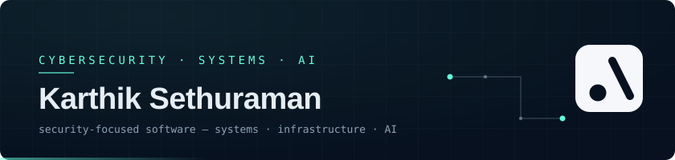

  
   
   

  <em>Cybersecurity undergraduate exploring cryptography, Linux, networking, and reliable AI systems.</em>
   
   

  
  
  

---

> **I build with AI, not around it.**
>
> AI has become part of my engineering workflow — from exploring unfamiliar ideas and debugging
> to prototyping and iteration. I still care about understanding the system underneath, making
> the design decisions, and knowing when not to trust the model.

## Selected Work

### EVL — Encrypted Virtual Locker
`systems / cryptography` · `C` `OpenSSL` `Argon2id` `FUSE`

A block-level encrypted file container built in C, combining authenticated encryption,
tamper detection, and FUSE filesystem access. Each block's AAD binds its file and position,
so reordering or cross-container transplant fails authentication instead of decrypting silently.

🔗 [Repository](https://github.com/Karthik-Sethu-Raman/evl)

### OfferGuard — AI recruitment-scam detection
`ai / security` · `TypeScript` `Next.js` `PostgreSQL` `pgvector`

An AI-assisted recruitment-scam detector combining deterministic red flags, vector retrieval,
and quote-verified LLM reasoning. The LLM advises; the final verdict is composed deterministically,
and every evidence quote is checked against the source text.

🔗 [Repository](https://github.com/Karthik-Sethu-Raman/OfferGuard) · [Live Demo](https://offerguard-seven.vercel.app)

### ULPF — Universal Log Pre-processing Framework
`infrastructure / security data` · `Python` `Kafka` `PostgreSQL` `OCSF` `Docker`

A security-log processing pipeline that preserves raw events, normalizes heterogeneous sources
into OCSF, and safely onboards previously unknown formats — an SLM proposes candidate parsing
rules, validation and human review decide whether they go active. `SIH 2026 · PS 26156`

🔗 [Repository](https://github.com/Karthik-Sethu-Raman/ulpf)

### Payment Integrity Verifier
`application security` · `Node.js` `TypeScript` `HMAC-SHA256` `Razorpay`

A deterministic security verifier for payment webhooks — signature validation, server-side
amount binding against trusted order state, replay protection, and a tamper-evident
hash-chained audit log. The LLM explains decisions; it never makes them.
`Razorpay AI Buildathon 2026`

🔗 [Repository](https://github.com/Karthik-Sethu-Raman/payment-integrity-verifier)

## Lab — currently exploring

| | | |
|---|---|---|
| **Qwen-ATLAS** | Threat-intelligence retrieval and local LLM reasoning | `revising` |
| **ModelFS** | AI-assisted filesystem and pre-OS interaction | `early idea` |
| **Sensitive Data Risk Classification** | Local classification of sensitive content, policy-aware detection | `ongoing` |

## Stack

| | |
|---|---|
| **Languages** | C, Python, TypeScript |
| **Systems & Crypto** | Linux, FUSE, OpenSSL, AES-256-GCM, Argon2id, HKDF, HMAC |
| **Data & Infra** | PostgreSQL, pgvector, Kafka, OCSF, Docker |
| **AI** | Retrieval (RAG), local LLMs (Ollama · Qwen3), constrained LLM pipelines |
| **Web** | React, Next.js, Node.js, Express |

## GitHub Stats

  
  

---

  Have something interesting to build? 
  <a href="mailto:karthiksethuraman6@gmail.com">karthiksethuraman6@gmail.com</a> · <a href="https://www.linkedin.com/in/karthik-sethuraman-1298bb320">LinkedIn</a>

